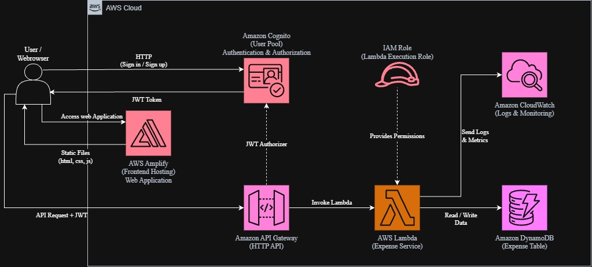

# Serverless Personal Expense Tracker
## Giải Pháp Serverless Trên AWS Cho Quản Lý Chi Tiêu Cá Nhân

### 1. Tóm tắt điều hành

Serverless Personal Expense Tracker là một ứng dụng web được thiết kế để giúp người dùng ghi nhận, quản lý, xem lại và tổng hợp các khoản chi tiêu cá nhân thông qua kiến trúc serverless trên AWS.

Ứng dụng cung cấp các chức năng quản lý chi tiêu cốt lõi bao gồm đăng ký và đăng nhập người dùng, thêm khoản chi tiêu, xem danh sách chi tiêu, chỉnh sửa và xóa khoản chi tiêu, lọc các khoản chi tiêu và xem bảng tổng hợp chi tiêu.

Frontend của ứng dụng được lưu trữ bằng AWS Amplify. Sau khi các tệp frontend được cung cấp cho trình duyệt của người dùng, trình duyệt sẽ giao tiếp trực tiếp với Amazon Cognito để xác thực và trực tiếp gọi Amazon API Gateway để thực hiện các yêu cầu API của ứng dụng. Amazon Cognito cung cấp chức năng xác thực và phát hành JWT token được sử dụng trong các API request.

Amazon API Gateway được cấu hình dưới dạng HTTP API với JWT authorizer sử dụng Amazon Cognito User Pool. Các request đã được xác thực sẽ được chuyển đến AWS Lambda, nơi chứa business logic của ứng dụng và thực hiện các thao tác đọc và ghi dữ liệu trên Amazon DynamoDB.

Amazon DynamoDB lưu trữ các bản ghi chi tiêu, trong khi Amazon CloudWatch cung cấp logging và monitoring cho quá trình thực thi Lambda. Lambda Execution Role của AWS IAM cung cấp cho Lambda các quyền cần thiết để truy cập DynamoDB và CloudWatch theo nguyên tắc quyền hạn tối thiểu.

Kiến trúc serverless giúp giảm nhu cầu quản lý các máy chủ truyền thống và cung cấp một giải pháp có khả năng mở rộng và tối ưu chi phí cho một ứng dụng quản lý chi tiêu cá nhân quy mô nhỏ.

### 2. Phát biểu vấn đề

### Vấn đề là gì?

Thông tin về chi tiêu cá nhân thường được ghi chép thủ công trong sổ tay, bảng tính hoặc các ứng dụng ghi chú đơn giản. Những phương pháp này có thể khiến việc tổ chức các khoản chi tiêu một cách nhất quán và nhanh chóng hiểu được thói quen chi tiêu trở nên khó khăn.

Người dùng cũng có thể cần tính tổng chi tiêu theo tháng, so sánh chi tiêu theo danh mục hoặc tìm kiếm các giao dịch trong một khoảng thời gian cụ thể. Việc thực hiện các tác vụ này thủ công có thể tốn thời gian và dẫn đến các bản ghi không nhất quán hoặc sai sót trong tính toán.

Ngoài ra, một ứng dụng web quản lý chi tiêu cần một kiến trúc backend phù hợp cho việc xác thực, lưu trữ dữ liệu và xử lý API. Việc sử dụng một máy chủ truyền thống chạy liên tục như EC2 có thể làm phát sinh các yêu cầu quản lý hạ tầng và chi phí không cần thiết đối với một ứng dụng cá nhân quy mô nhỏ.

### Giải pháp

Dự án đề xuất xây dựng một Serverless Personal Expense Tracker sử dụng các dịch vụ AWS.

Người dùng truy cập ứng dụng web thông qua trình duyệt. AWS Amplify lưu trữ và triển khai frontend, trong khi trình duyệt giao tiếp trực tiếp với Amazon Cognito để đăng ký và đăng nhập người dùng. Sau khi xác thực thành công, Cognito trả về JWT token cho trình duyệt.

Trình duyệt gửi các request quản lý chi tiêu đã được xác thực đến Amazon API Gateway bằng JWT token trong Authorization header. API Gateway xác thực JWT bằng JWT authorizer dựa trên Cognito và gọi AWS Lambda đối với các request hợp lệ.

AWS Lambda xử lý logic quản lý chi tiêu và thực hiện các thao tác tạo, đọc, cập nhật và xóa trên Amazon DynamoDB. DynamoDB lưu trữ các bản ghi chi tiêu được liên kết với người dùng đã xác thực.

Ứng dụng cũng có thể cung cấp các chức năng lọc và tổng hợp, cho phép người dùng xem tổng chi tiêu và phân tích chi tiêu theo ngày hoặc danh mục.

AWS IAM Lambda Execution Role cung cấp cho Lambda các quyền cần thiết để truy cập DynamoDB và ghi log vào CloudWatch theo nguyên tắc quyền hạn tối thiểu. Amazon CloudWatch được sử dụng để logging và monitoring quá trình thực thi Lambda.

### Lợi ích và giá trị mang lại

Giải pháp chuyển đổi việc theo dõi chi tiêu cá nhân từ quy trình thủ công thành một ứng dụng web, cho phép người dùng đã xác thực quản lý các bản ghi chi tiêu của họ trực tiếp từ trình duyệt.

Việc sử dụng kiến trúc serverless giúp giảm yêu cầu quản lý hạ tầng vì không cần duy trì một application server chạy liên tục. AWS Lambda chỉ thực thi logic ứng dụng khi có API request được gửi đến.

Amazon Cognito cung cấp chức năng xác thực người dùng, trong khi API Gateway và JWT authorizer giúp bảo vệ các API route của ứng dụng để dữ liệu chi tiêu chỉ có thể được truy cập thông qua các request đã được xác thực.

Dự án cũng tạo nền tảng cho các cải tiến trong tương lai như quản lý ngân sách, cảnh báo ngân sách, phân tích nâng cao, trực quan hóa chi tiêu, chi tiêu định kỳ hoặc bổ sung các dịch vụ thông báo.

Chi phí vận hành dự kiến tương đối thấp đối với workload quy mô nhỏ vì các dịch vụ AWS chính sử dụng cơ chế tính phí theo mức sử dụng. Chi phí hàng tháng và hàng năm cuối cùng sẽ được ước tính bằng AWS Pricing Calculator dựa trên số lượng người dùng dự kiến, số lượng API request, hoạt động cơ sở dữ liệu, mức sử dụng frontend và hoạt động monitoring.

### 3. Kiến trúc giải pháp

Hệ thống sử dụng kiến trúc AWS Serverless để cung cấp một ứng dụng quản lý chi tiêu cá nhân có xác thực.

AWS Amplify lưu trữ và triển khai frontend của ứng dụng. Người dùng / trình duyệt web truy cập frontend thông qua Amplify và chạy mã frontend trực tiếp trên trình duyệt.

Trình duyệt giao tiếp trực tiếp với Amazon Cognito để đăng ký và đăng nhập. Sau khi xác thực thành công, Cognito trả về JWT token cho trình duyệt.

Trình duyệt gửi API request cùng JWT token đến Amazon API Gateway thông qua HTTP API. API Gateway sử dụng JWT authorizer được cấu hình với Cognito User Pool để xác thực token trước khi gọi AWS Lambda.

AWS Lambda chứa expense service và business logic của ứng dụng. Lambda thực hiện các thao tác tạo, đọc, cập nhật và xóa trên Amazon DynamoDB và có thể tạo các thông tin tổng hợp chi tiêu cho người dùng đã xác thực.

Amazon DynamoDB lưu trữ dữ liệu chi tiêu. Amazon CloudWatch thu thập log và metric của Lambda để monitoring, troubleshooting và theo dõi hoạt động của hệ thống.

Lambda Execution Role cung cấp cho Lambda các quyền cần thiết để truy cập DynamoDB và CloudWatch.

Kiến trúc hệ thống

### Các dịch vụ AWS được sử dụng

- **AWS Amplify**: Lưu trữ và triển khai web frontend, đồng thời cung cấp các tệp frontend tĩnh.

- **Amazon Cognito**: Cung cấp chức năng đăng ký, đăng nhập và xác thực người dùng thông qua User Pool và phát hành JWT token.

- **Amazon API Gateway**: Cung cấp HTTP API, nhận API request từ trình duyệt của người dùng và sử dụng JWT authorizer để xác thực các request.

- **AWS Lambda**: Thực thi business logic quản lý chi tiêu và xử lý các API request.

- **Amazon DynamoDB**: Lưu trữ các bản ghi chi tiêu và hỗ trợ các thao tác tạo, đọc, cập nhật và xóa.

- **AWS IAM**: Cung cấp Lambda Execution Role với các quyền cần thiết để truy cập DynamoDB và CloudWatch.

- **Amazon CloudWatch**: Cung cấp logging, metrics và monitoring cho quá trình thực thi Lambda.

### Thiết kế thành phần

- **Web Frontend**: AWS Amplify lưu trữ ứng dụng web. Trình duyệt của người dùng chạy mã frontend sau khi nhận được các tệp tĩnh.

- **Xác thực người dùng**: Amazon Cognito User Pool xử lý đăng ký và đăng nhập người dùng và trả về JWT token cho trình duyệt.

- **API Layer**: Amazon API Gateway cung cấp HTTP API được frontend sử dụng. JWT authorizer dựa trên Cognito xác thực JWT được gửi trong Authorization header.

- **Expense Service**: AWS Lambda chứa business logic của ứng dụng cho việc tạo, đọc, cập nhật, xóa, lọc và tổng hợp các bản ghi chi tiêu.

- **Data Storage**: Amazon DynamoDB lưu trữ các bản ghi chi tiêu. Mỗi bản ghi được liên kết với người dùng đã xác thực để người dùng có thể quản lý dữ liệu chi tiêu của chính mình.

- **Security**: Amazon Cognito xác thực người dùng và API Gateway xác thực JWT token. IAM Lambda Execution Role cung cấp cho Lambda các quyền tối thiểu cần thiết để truy cập DynamoDB và CloudWatch.

- **Monitoring**: Amazon CloudWatch thu thập log và metric của Lambda để troubleshooting, monitoring và theo dõi hoạt động.

### Dữ liệu chi tiêu cốt lõi

Ứng dụng có thể lưu trữ các bản ghi chi tiêu với các trường như:

- **userId**: Xác định người dùng đã xác thực sở hữu bản ghi chi tiêu.

- **expenseId**: Mã định danh duy nhất của bản ghi chi tiêu.

- **amount**: Số tiền chi tiêu.

- **category**: Danh mục chi tiêu như Food, Transportation, Shopping, Bills hoặc Other.

- **description**: Mô tả tùy chọn của khoản chi tiêu.

- **date**: Ngày phát sinh chi tiêu.

- **createdAt**: Timestamp dùng để ghi nhận thời điểm bản ghi chi tiêu được tạo.

### Các API endpoint cốt lõi

HTTP API có thể cung cấp các endpoint như:

- **GET /expenses**: Lấy các bản ghi chi tiêu của người dùng đã xác thực.

- **POST /expenses**: Tạo một bản ghi chi tiêu mới.

- **PUT /expenses/{id}**: Cập nhật một bản ghi chi tiêu hiện có.

- **DELETE /expenses/{id}**: Xóa một bản ghi chi tiêu.

- **GET /summary**: Trả về thông tin tổng hợp chi tiêu như tổng số tiền và tổng theo từng danh mục.

### 4. Triển khai kỹ thuật

**Các giai đoạn triển khai**

Dự án tập trung xây dựng một ứng dụng quản lý chi tiêu serverless hoàn chỉnh. Quá trình triển khai có thể được chia thành bốn giai đoạn:

- Thiết kế yêu cầu và kiến trúc: Xác định các yêu cầu quản lý chi tiêu, xác định các dịch vụ AWS cần sử dụng, hoàn thiện kiến trúc và thiết kế cấu trúc dữ liệu DynamoDB cũng như các API endpoint.

- Phát triển xác thực và backend: Cấu hình Amazon Cognito, tạo API Gateway HTTP API với JWT authorizer, triển khai business logic trên AWS Lambda và cấu hình các thao tác với DynamoDB.

- Phát triển frontend và tích hợp: Xây dựng giao diện web, triển khai các luồng xác thực, tạo các màn hình quản lý chi tiêu, kết nối frontend trực tiếp với Cognito và API Gateway, đồng thời hiển thị dữ liệu chi tiêu và thông tin tổng hợp.

- Testing, monitoring, optimization và deployment: Thực hiện end-to-end testing, cấu hình quyền IAM và CloudWatch monitoring, xử lý lỗi, tối ưu ứng dụng, triển khai frontend cuối cùng và hoàn thiện tài liệu hệ thống.

**Yêu cầu kỹ thuật**

- **Machine Learning:** Không cần thiết đối với MVP hiện tại.

- **Database:** Amazon DynamoDB để lưu trữ các bản ghi chi tiêu.

- **Backend:** AWS Lambda để xử lý các request quản lý chi tiêu.

- **API:** Amazon API Gateway HTTP API với JWT authorizer.

- **Authentication:** Amazon Cognito User Pool cho đăng ký, đăng nhập và xác thực dựa trên JWT.

- **Frontend:** Một ứng dụng web cho phép người dùng đã xác thực thêm, xem, chỉnh sửa, xóa, lọc và tổng hợp các khoản chi tiêu.

- **Deployment:** AWS Amplify để hosting và deployment frontend.

- **Security:** Xác thực dựa trên Cognito, JWT authorization trên API Gateway và IAM Lambda Execution Role với các quyền tối thiểu cần thiết.

- **Monitoring:** Amazon CloudWatch Logs và Metrics.

### 5. Tiến độ & các mốc quan trọng

**Tiến độ dự án**

Dự án sẽ được phát triển trong **12 tuần thực tập**, kết hợp việc học AWS, phát triển Machine Learning, triển khai serverless, testing và documentation.

### Tuần 1 – AWS Fundamentals

- Tạo và cấu hình tài khoản AWS.

- Học về quản lý chi phí AWS và AWS Support.

- Nghiên cứu AWS IAM và quản lý quyền truy cập.

- Học các kiến thức nền tảng về networking với Amazon VPC.

- Nghiên cứu các kiến thức cơ bản về Amazon EC2.

- Hiểu các khái niệm cơ bản về hạ tầng AWS và cloud services.

**Milestone:** Hoàn thành các module học tập AWS cơ bản và hiểu môi trường AWS.

### Tuần 2 – AWS Compute, Storage & Database Services

- Học IAM Roles cho EC2.

- Nghiên cứu AWS Cloud9.

- Học Amazon S3 và static website hosting.

- Nghiên cứu Amazon RDS.

- Học AWS Lambda và serverless computing.

- Hiểu cách các dịch vụ storage, database và serverless của AWS có thể được sử dụng trong một dự án.

**Milestone:** Xây dựng kiến thức nền tảng về các dịch vụ AWS liên quan đến dự án serverless.

### Tuần 3 – AWS Serverless Learning & Project Direction

- Tiếp tục nghiên cứu các dịch vụ AWS serverless và API liên quan.

- Ôn tập các khái niệm về AWS Lambda và API Gateway.

- Xác định yêu cầu của Personal Expense Tracker.

- So sánh các kiến trúc dự án có thể sử dụng và xác nhận hướng tiếp cận serverless.

- Bắt đầu xác định các chức năng cốt lõi của ứng dụng.

**Milestone:** Xác nhận ý tưởng Serverless Personal Expense Tracker và các dịch vụ AWS chính.

### Tuần 4 – Project Requirements & Architecture Design

- Hoàn thiện yêu cầu dự án.

- Hoàn thiện kiến trúc AWS.

- Xác định luồng xác thực bằng Amazon Cognito.

- Thiết kế cấu trúc dữ liệu chi tiêu trên DynamoDB.

- Xác định các API endpoint cho việc quản lý chi tiêu.

- Tài liệu hóa các luồng browser, authentication, API, backend, database, IAM và monitoring.

**Milestone:** Hoàn thành kiến trúc ban đầu và thiết kế kỹ thuật của dự án.

### Tuần 5 – AWS Cognito & Frontend Foundation

- Cấu hình Amazon Cognito User Pool.

- Triển khai đăng ký và đăng nhập người dùng.

- Kiểm tra quá trình tạo JWT token và authentication.

- Tạo frontend application ban đầu.

- Cấu hình AWS Amplify cho frontend hosting và deployment.

**Milestone:** Hoàn thành authentication flow và thiết lập môi trường frontend ban đầu.

### Tuần 6 – API Gateway, Lambda & DynamoDB

- Tạo Amazon API Gateway HTTP API.

- Cấu hình JWT authorizer sử dụng Amazon Cognito.

- Tạo DynamoDB ExpenseTable.

- Phát triển các Lambda function cho quản lý chi tiêu.

- Triển khai các thao tác tạo, đọc, cập nhật và xóa.

- Kiểm tra các API request đã được xác thực.

**Milestone:** Hoàn thành serverless backend cốt lõi có authentication.

### Tuần 7 – Expense Management Frontend

- Xây dựng giao diện nhập chi tiêu.

- Triển khai form cho amount, category, date và description.

- Kết nối frontend trực tiếp với API Gateway bằng các request đã xác thực.

- Triển khai chức năng xem danh sách, chỉnh sửa và xóa chi tiêu.

- Triển khai validation và error handling ở frontend.

**Milestone:** Hoàn thành các chức năng quản lý chi tiêu chính.

### Tuần 8 – Filtering & Dashboard

- Triển khai lọc theo ngày hoặc tháng.

- Triển khai lọc theo danh mục chi tiêu.

- Tính toán tổng chi tiêu.

- Tạo dashboard cho các thông tin tổng hợp chi tiêu.

- Hiển thị phân tích chi tiêu theo danh mục.

- Cải thiện khả năng sử dụng của frontend.

**Milestone:** Hoàn thành các chức năng xem xét và tổng hợp chi tiêu chính.

### Tuần 9 – Security & Monitoring

- Cấu hình Lambda Execution Role bằng IAM.

- Áp dụng nguyên tắc quyền hạn tối thiểu.

- Kiểm tra quyền truy cập DynamoDB của Lambda.

- Kiểm tra các quyền Lambda cần thiết cho CloudWatch logging.

- Xem xét log và metric trên Amazon CloudWatch.

- Kiểm tra các API request không được xác thực và request không hợp lệ.

**Milestone:** Hoàn thành cấu hình security và monitoring.

### Tuần 10 – System Testing & Error Handling

- Thực hiện end-to-end testing.

- Kiểm tra đăng ký và authentication của người dùng.

- Kiểm tra các thao tác CRUD của expense.

- Kiểm tra filtering và summary functions.

- Kiểm tra các request không hợp lệ, thiếu dữ liệu và không được phép.

- Xác định và sửa các vấn đề liên quan đến frontend, API Gateway, Lambda và DynamoDB.

**Milestone:** Hoàn thành system testing và xử lý các vấn đề lớn của ứng dụng.

### Tuần 11 – Optimization & Production Deployment

- Tối ưu Lambda functions và API processing.

- Xem xét các access pattern và cách truy xuất dữ liệu trên DynamoDB.

- Kiểm tra CloudWatch logs và monitoring.

- Triển khai phiên bản frontend mới nhất bằng AWS Amplify.

- Kiểm tra ứng dụng thông qua giao diện web production.

- Xem xét mức sử dụng tài nguyên AWS và chi phí dự kiến.

**Milestone:** Triển khai phiên bản production ổn định của Personal Expense Tracker.

### Tuần 12 – Finalization & Documentation

- Hoàn thiện kiến trúc AWS và hệ thống.

- Xem xét toàn bộ ứng dụng.

- Đánh giá kết quả dự án so với các mục tiêu ban đầu.

- Tài liệu hóa quá trình triển khai.

- Hoàn thành Worklog thực tập và tài liệu dự án.

- Chuẩn bị phần trình bày và demo dự án cuối kỳ.

**Milestone:** Hoàn thành và trình bày Serverless Personal Expense Tracker.

### 6. Ước tính ngân sách

Chi phí của hệ thống phụ thuộc vào số lượng người dùng đã xác thực, số lượng API request, thời gian thực thi Lambda, dung lượng lưu trữ và số lần đọc/ghi trên DynamoDB, mức sử dụng frontend hosting và số lượng log/metric trên CloudWatch.

AWS Pricing Calculator sẽ được sử dụng để ước tính chi phí hàng tháng và hàng năm dự kiến dựa trên workload thực tế của dự án.

### Chi phí hạ tầng

- AWS Lambda: Chi phí phụ thuộc vào số lượng API request và thời gian thực thi Lambda.

- Amazon API Gateway: Chi phí phụ thuộc vào số lượng HTTP API request.

- Amazon DynamoDB: Chi phí phụ thuộc vào dung lượng lưu trữ và mức sử dụng đọc/ghi cơ sở dữ liệu.

- Amazon Cognito: Chi phí phụ thuộc vào số lượng monthly active users và mức sử dụng authentication.

- AWS Amplify: Chi phí phụ thuộc vào frontend hosting, storage và data transfer.

- Amazon CloudWatch: Chi phí phụ thuộc vào lượng log và metric được tạo ra và thời gian lưu trữ.

- AWS IAM: IAM roles không có khoản phí riêng.

### Tối ưu chi phí

Do dự án được thiết kế cho workload quản lý chi tiêu cá nhân quy mô nhỏ, số lượng người dùng và request dự kiến tương đối thấp. Kiến trúc serverless tránh chi phí duy trì một EC2 instance liên tục khi ứng dụng không nhận request.

Các biện pháp tối ưu chi phí bổ sung có thể bao gồm:

- Giữ thiết kế DynamoDB đơn giản và chỉ truy xuất các dữ liệu chi tiêu cần thiết.

- Tối ưu thời gian thực thi Lambda và giảm các xử lý không cần thiết.

- Thiết lập thời gian retention phù hợp cho CloudWatch logs.

- Theo dõi mức sử dụng của Cognito, DynamoDB, API Gateway, Lambda và Amplify.

- Sử dụng AWS Budgets để theo dõi và kiểm soát chi phí.

Chi phí hàng tháng và hàng năm cuối cùng sẽ được tính toán sau khi xác định workload dự kiến bằng AWS Pricing Calculator.

### 7. Đánh giá rủi ro

#### Ma trận rủi ro

- Truy cập trái phép vào dữ liệu chi tiêu: Tác động cao, xác suất thấp.

- Lambda không thể truy cập DynamoDB do IAM permissions không chính xác: Tác động cao, xác suất thấp.

- API hoặc frontend gặp lỗi: Tác động trung bình, xác suất thấp.

- Chi phí AWS tăng ngoài dự kiến: Tác động trung bình, xác suất thấp.

- Mất dữ liệu hoặc bản ghi chi tiêu không chính xác: Tác động cao, xác suất thấp.

- Lỗi cấu hình authentication hoặc JWT: Tác động cao, xác suất thấp.

#### Chiến lược giảm thiểu

- Authentication và authorization: Sử dụng Amazon Cognito để xác thực người dùng và cấu hình JWT authorization trên API Gateway cho các API route được bảo vệ.

- DynamoDB/Lambda access: Kiểm tra IAM permissions và đảm bảo Lambda Execution Role tuân theo nguyên tắc quyền hạn tối thiểu.

- API reliability: Kiểm tra API Gateway với các request hợp lệ, không hợp lệ, thiếu dữ liệu và không được phép trước khi deployment.

- Data integrity: Validation dữ liệu chi tiêu và kiểm tra cẩn thận các thao tác tạo, cập nhật và xóa.

- Cost control: Sử dụng AWS Budgets và theo dõi mức sử dụng Lambda, DynamoDB, API Gateway, Cognito, CloudWatch và Amplify.

- Monitoring: Xem xét CloudWatch logs và metrics để xác định các lỗi ứng dụng và vấn đề vận hành.

#### Kế hoạch dự phòng

Nếu web application đã triển khai không khả dụng, nhóm dự án có thể sử dụng development environment để tiếp tục testing và debugging trong khi khôi phục phiên bản đã triển khai.

Nếu một bản cập nhật ứng dụng tạo ra hành vi không mong muốn, frontend hoặc Lambda version hoạt động trước đó có thể được khôi phục trong khi vấn đề được sửa chữa.

Nếu cấu hình database hoặc authentication gây ra vấn đề trong quá trình development, component bị ảnh hưởng có thể được cô lập và kiểm tra độc lập trước khi tích hợp lại vào hệ thống hoàn chỉnh.

### 8. Kết quả mong đợi

#### Cải thiện kỹ thuật:

Dự án được kỳ vọng sẽ chuyển đổi việc theo dõi chi tiêu cá nhân từ quy trình thủ công thành một Serverless Web Application có thể được truy cập thông qua trình duyệt web.

Người dùng sẽ có thể:

- Truy cập ứng dụng web.

- Đăng ký và đăng nhập an toàn.

- Thêm các bản ghi chi tiêu mới.

- Xem lịch sử chi tiêu.

- Chỉnh sửa và xóa các bản ghi chi tiêu.

- Lọc chi tiêu theo ngày hoặc danh mục.

- Xem tổng chi tiêu và các thông tin tổng hợp theo danh mục.

Người dùng có thể quản lý chi tiêu mà không cần cài đặt một desktop application riêng hoặc tự duy trì một backend server cá nhân.

#### Giá trị lâu dài

Kiến trúc được thiết kế theo hướng module, cho phép bổ sung các chức năng mới mà không cần thay đổi lớn đối với toàn bộ hệ thống.

Các cải tiến trong tương lai có thể bao gồm:

- Quản lý ngân sách và cảnh báo ngân sách.

- Hỗ trợ chi tiêu định kỳ.

- Phân tích và trực quan hóa nâng cao.

- Bổ sung các danh mục chi tiêu và danh mục tùy chỉnh.

- Notifications sử dụng các dịch vụ AWS bổ sung.

- Export dữ liệu chi tiêu.

- Monitoring và reporting nâng cao.

Dự án cũng mang lại kinh nghiệm thực tế trong việc kết hợp web development, AWS Cloud, authentication, database design, serverless computing và monitoring, phù hợp với chuyên ngành Khoa học dữ liệu.